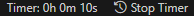

# Clocking Timer

## Description

Cette extension VSCode permet de suivre le temps passé sur un projet. Elle offre des fonctionnalités telles que le démarrage/arrêt automatique du timer et l'affichage du temps total passé.

## Installation

Pour installer l'extension, accédez au [VSCode Marketplace](lien vers votre extension) et cliquez sur "Installer".

## Utilisation

Pour utiliser l'extension, cliquez sur le bouton "Start Timer" dans la barre d'état pour commencer à suivre le temps. Le bouton changera en "Stop Timer" une fois activé.

## Fonctionnalités

- **Timer Automatique**: Démarre et arrête automatiquement le timer en fonction de l'activité dans l'éditeur.
- **Affichage du Temps Total**: Montre le temps total passé sur le projet.

## Contribuer

Les contributions sont toujours les bienvenues! Veuillez forker le repo et créer une pull request avec vos modifications.

## Support et Feedback

Pour toute question ou suggestion, ouvrez une issue sur [GitHub](https://github.com/matbel91765/clockingtimer/issues).

## Auteurs et Remerciements

Créé par Belouar-Pruvot Mathis

## Licence

Ce projet est sous licence MIT. Voir le fichier [LICENSE]./LICENCE pour plus de détails.
